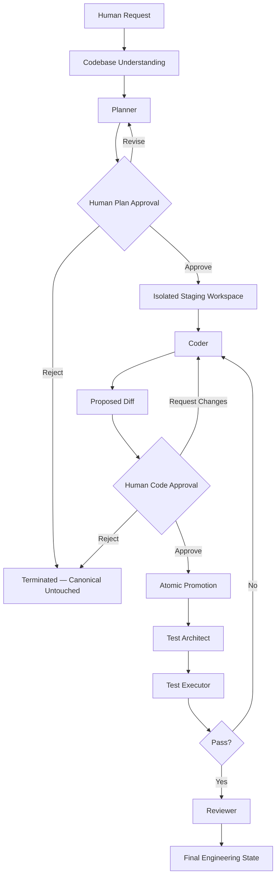
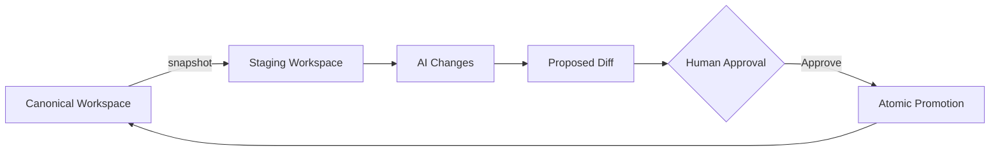

<div align="center">

# RLB
### Relax. Lemme Build.

**An AI software engineering workspace built on a simple idea:**
**capability and control are not opposites.**

[]()
[]()
[]()
[]()

</div>

---

## One more thing about AI coding tools.

Every AI coding tool today makes the same bet:

```
Prompt → LLM → Code
```

It's fast. It's magical the first time. And it completely ignores the fact that
software engineering was never just "generate the code." It's understanding,
deciding, isolating, testing, reviewing, and — critically — **choosing what
actually gets to ship.**

Most AI tools skip straight to the last step and hope for the best.

**RLB doesn't skip steps. It builds an engineering organization around them.**

---

## The idea, in one sentence

> **RLB is a multi-agent AI software engineering workspace that orchestrates repository understanding, isolated coding, verification, review, and human-approved promotion — through a persistent, stateful workflow.**

Or, if you'd rather have the version without the semicolons:

> **You tell RLB what to build. Its agents handle the engineering loop. You stay in control of what gets accepted.**

---

## Why this needed to exist

Give an AI unrestricted write access to your repository, and you've made a trade:
speed, for trust. RLB refuses that trade. Instead, it breaks the engineering loop
into specialized roles, gives each one exactly the permissions it needs and no
more, and puts a human at every consequential decision point.

| The old way | The RLB way |
|---|---|
| One agent, unrestricted repo access | Five specialized agents, scoped permissions |
| AI writes straight to your codebase | AI writes to an isolated staging workspace |
| "Trust me, it works" | An inspectable, unified diff |
| Tests as an afterthought | A dedicated agent whose only job is deciding what *should* be tested |
| One model reviewing its own work | An independent Reviewer that never touches code |
| Conversation state, gone when the tab closes | Persistent, durable, queryable application state |

---

## The Engineering Loop



Two gates. Zero shortcuts. Every step, remembered.

---

## Five Agents. One Discipline: Least Privilege.

RLB doesn't ask one model to pretend to be an entire engineering org. It builds
the org.

<table>
<tr><th>Agent</th><th>Job</th><th>Permissions</th></tr>
<tr><td><b>Planner</b></td><td>Understands the request. Produces an implementation plan — affected files, steps, architectural reasoning, validation requirements.</td><td>Read only. Cannot write. Cannot execute.</td></tr>
<tr><td><b>Coder</b></td><td>Converts an <i>approved</i> plan into real file changes.</td><td>Read + write — to staging <b>only</b>. Never touches canonical.</td></tr>
<tr><td><b>Test Architect</b></td><td>Decides what should be verified: functional, regression, edge-case, and security behavior.</td><td>Read only. Designs tests, doesn't run them.</td></tr>
<tr><td><b>Test Executor</b></td><td>Runs the mandatory baseline and generated tests inside a sandbox.</td><td>Execute — sandbox only. No canonical modification.</td></tr>
<tr><td><b>Reviewer</b></td><td>Independently audits the request, plan, diff, and test results.</td><td>Read only. Cannot rewrite the code it reviews.</td></tr>
</table>

No agent grades its own homework. No agent has more access than its job requires.

---

## Staging Isn't a Feature. It's the Whole Point.



An AI should be able to experiment freely — without ever putting your accepted
code at risk. So the Coder never sees the canonical workspace. It sees a
snapshot. Every change lives in staging until a human looks at the diff and
says yes.

And promotion itself isn't a series of file overwrites hoping nothing breaks
mid-way — it's designed as an **atomic operation**: validate, apply, update
canonical, update metadata, snapshot. If it fails, canonical integrity is
preserved.

---

## The Workflow Doesn't Trust the Model to Run Itself

This is the part most AI coding tools don't have at all: an explicit,
deterministic **workflow state machine**.

```
IDLE → ANALYZING → READY → PLANNING → PLAN_REVIEW → STAGING_SETUP →
CODING → CODE_REVIEW → STAGING_CLEANUP → PROMOTING →
TEST_PLANNING → TEST_EXECUTING → REVIEWING → COMPLETED
                                          ↘ CANCELLED / FAILED
```

The model doesn't decide what happens next. **The workflow engine does.**
Agents perform bounded pieces of work inside states they don't control the
transitions of. That's what makes the whole loop auditable instead of
improvised.

Behind it: a durable job queue with leases, heartbeats, and worker ownership —
because your AI task shouldn't die just because you closed a browser tab.

---

## Models Are Interchangeable. Your Workflow Isn't.

```
Agent Role → Worker → Provider Adapter → Model
```

RLB separates *what an agent's job is* from *which model happens to be doing
it right now*. A **loadout** decides routing — which worker handles Planning,
which handles Coding, which handles Review, each with a primary and a
fallback.

```
CODER
 ├── Primary:  Worker A
 └── Fallback: Worker C
```

And when a worker fails mid-task —

```
Coder → Worker A → 429 Rate Limit → Fallback Worker B → same task, same context, same workflow
```

— that's **hot swapping**: a model failure doesn't have to mean a task
failure. Every output keeps its provenance, so the system always knows which
worker actually produced it.

Currently shipping: a Groq gateway. Architected for: a full provider
ecosystem, including Gemini and OpenRouter.

---

## Nothing Lives Only Inside a Chat Window

Tasks, plans, diffs, approvals, test runs, and review reports are persistent
application state — not context that evaporates when a conversation ends.

The schema spans **27 relational entities** across users, workers, loadouts,
workspaces, staging workspaces, files, codebase analyses, conversations,
tasks, agent runs, plans, approvals, diffs, test plans, test executions,
build results, reviewer reports, and Git snapshots.

Built on PostgreSQL / Supabase, with Row Level Security, encrypted
credentials at rest, and server-side authorization — because "trust the
client" isn't a security model.

---

## The Stack

<table>
<tr><td valign="top">

**Frontend**
- Next.js
- React + TypeScript
- Tailwind CSS
- Monaco Editor
- Supabase JS client

</td><td valign="top">

**Backend**
- FastAPI (Python)
- Pydantic
- SQLAlchemy + asyncpg
- JWT auth

</td><td valign="top">

**Data**
- PostgreSQL
- Supabase
- Row Level Security

</td><td valign="top">

**AI**
- Provider abstraction
- Groq gateway
- Loadouts + fallback

</td><td valign="top">

**Execution**
- Staging workspaces
- Sandbox abstraction
- Daytona integration path
- Atomic promotion

</td></tr>
</table>

The workspace itself feels less like a chat window bolted onto a code editor,
and more like an IDE that happens to have an engineering team living inside
it — file explorer, editor, AI panel, agent activity feed, diff review, test
execution, and final review, all in one surface.

---

## The Honest Part

Apple keynotes don't usually include a slide like this. We're including one
anyway, because a control-plane product without honesty about its own state
would be missing the point.

**Solid foundations already in place:** workspace management, authentication,
task orchestration, the Planner/Coder/Reviewer services, staging isolation,
the workflow state machine, provider abstraction, loadouts, persistence, test
orchestration, the frontend workspace experience, durable worker execution,
and the security boundaries described above.

**Locally verified, pending hosted acceptance:** the Daytona SDK adapter,
Supabase queue/storage composition, encrypted provider runtime and transient
fallback are implemented. Local acceptance uses deterministic doubles; project
commands never execute on the API host. The existing cloud accounts were
intentionally unused in this engineering pass. Real Auth/RLS, queue recovery,
transactional promotion and Daytona execution still require staging validation.
Git URL import remains a note-only UI option; use ZIP import for the working flow.

See [local commands](docs/LOCAL_DEVELOPMENT.md), [hosted setup](docs/HOSTED_SETUP.md),
and [engineering verification](docs/ENGINEERING_VERIFICATION.md).

So the fair description is:

> **A substantial working foundation for a full AI software-engineering platform, with parts of the final production architecture still being completed.**

---

## What Using RLB Actually Feels Like

```
You:        "Add OAuth authentication to my application."

RLB:        [analyzes the repository]

Planner:    "Here is what needs to change."
You:        Approve.

RLB:        [creates isolated staging]

Coder:      [implements the approved plan]

RLB:        "Here is the exact diff."
You:        Approve.

Test Architect:  "Here is what must be verified."
Test Executor:   [runs baseline + generated tests]

                 Failures? → structured feedback → Coder → retest
                 Pass?     → continue

Reviewer:   [audits the full result]

RLB:        Final engineering state.
```

You're not micromanaging every line. You're also never handing over the
keys.

---

## The Big Picture

> **What happens when AI moves from being a coding assistant to becoming an engineering organization inside the development environment?**

Instead of one model pretending to be Planner, Coder, Tester, Reviewer,
DevOps, and PM all at once — RLB creates the roles for real, gives each one
permission boundaries, forces every change through staging → diff → approval
→ promotion, and treats test → review → audit as non-negotiable instead of
optional.

That's the whole idea. Everything else is implementation detail.

<div align="center">

---

### RLB — Relax. Lemme Build.

*An AI engineering operating environment. Not an autocomplete tool.*

</div>
