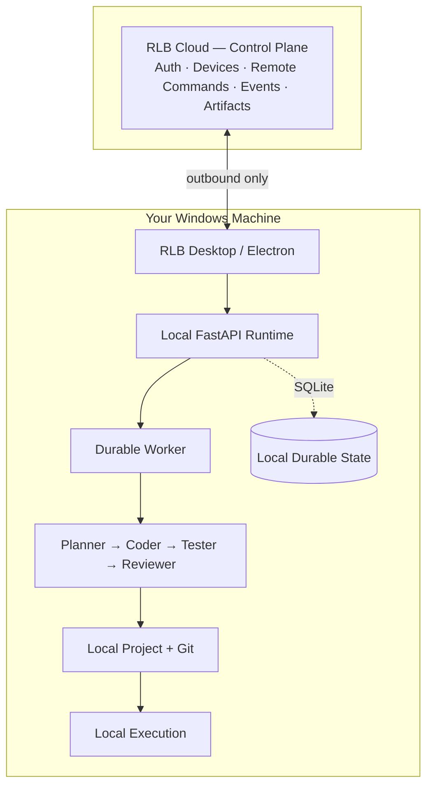
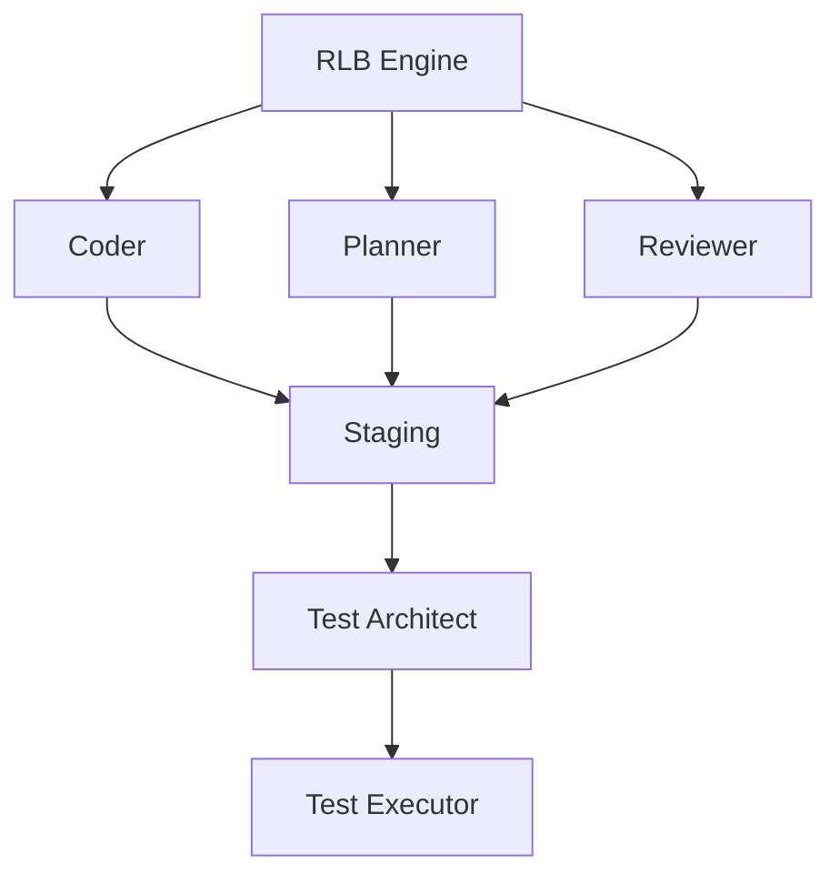

<div align="center">

# RLB
### Build on your machine. Control from anywhere.

**An AI engineering runtime that lives on your PC — with a cloud control plane**
**that lets you watch and direct it from anywhere.**

[]()
[]()
[]()

</div>

---

## One more thing about where RLB actually runs.

We built RLB as a cloud IDE first. A browser tab was the whole product —
project, agents, sandbox, database, execution, all living on our
infrastructure, with the web as the only way in.

Then we asked the question that mattered more than any feature:

> **Why should your code have to live somewhere else just so AI can work on it?**

So we moved it. Not the philosophy — the *center of gravity*.

**RLB didn't get a new feature. It got a new home: your computer.**

---

## Before and after

<table>
<tr><th>Before</th><th>Now</th></tr>
<tr><td>

```
┌─────────────────────┐
│     RLB CLOUD       │
│                      │
│ Workspace            │
│ Agents               │
│ Sandbox              │
│ Database             │
│ Execution            │
└──────────┬───────────┘
           │
          WEB
```

</td><td>

```
      ┌───────────────┐
      │   RLB CLOUD   │
      │ Control Plane │
      └───────┬───────┘
              │
        Remote Control
              │
              ▼
 ┌──────────────────────────┐
 │     RLB ON WINDOWS       │
 │                          │
 │ Project · Git            │
 │ Agents · Workflow        │
 │ Worker · Tests           │
 │ Execution · SQLite       │
 └────────────┬─────────────┘
              │
              ▼
       YOUR CODEBASE
```

</td></tr>
</table>

Same engineering organization. Different place to live.

---

## The idea, in one sentence

> **RLB is an AI engineering runtime for your own computer, where specialized agents plan, code, test, and review software under human approval — while a cloud-backed web console lets you control and observe the runtime from anywhere.**

That's a meaningfully more specific claim than "AI software-engineering
workspace." It says exactly where the work happens, and exactly what the
cloud is actually for.

---

## Three Layers, One Clear Owner



### 1 · Windows runtime — the actual RLB

This is where the real work happens, full stop. Your machine owns:

- your project files and Git repository
- task execution and agent workflow
- the durable local worker
- SQLite state, local snapshots
- local testing, staging, and promotion

**And it keeps working even if the internet disappears.** The runtime was
never designed to depend on a live cloud connection to do its job.

### 2 · Cloud — the control plane, not the computer

The cloud stopped trying to be your development environment. Its job now:

```
Identity → Device Registration → Device Pairing →
Remote Commands → Events / Sync → Artifacts
```

It's coordination infrastructure. It doesn't hold your codebase, and it
doesn't need to.

### 3 · Web — the remote cockpit

The website is now where you *watch and direct*, not where the work lives.
Away from your desk, you open RLB and see exactly what your machine is
doing:

```
My Windows PC                    ● Online

Current Task
"Add OAuth authentication"

Planner        ✓ Complete
Plan Approval  ✓ Approved
Coder          ● Working
Tests          Waiting

[ Pause ]  [ Stop ]  [ Send Prompt ]  [ View Events ]  [ View Artifacts ]
```

You're not running the project in a browser tab. **You're operating a
machine that's running it for you.**

---

## Local-First Is the Principle, Not a Checkbox

Your project files never have to leave your computer just because you want
remote visibility.

```
Your PC
│
├── my-app/                 ← your actual codebase, stays put
│   ├── src/
│   ├── package.json
│   └── ...
│
└── RLB
    ├── workflow
    ├── agents
    ├── worker
    └── SQLite

Windows PC
    │
    ├── actual code
    ├── execution
    ├── agent work
    └── task state
          │
          │ selected events only
          ▼
        Cloud
          │
          ▼
         Web
```

The cloud doesn't need your repository to let you check on your Coder's
progress from your phone. It needs a stream of events. That's the whole
local-first bet.

---

## What Didn't Change: The Engineering Organization

This is the part we didn't rebuild — because it was never the problem.



And the two human gates are still the spine of the product:

```
Plan → HUMAN APPROVAL → Code → HUMAN APPROVAL → Promotion → Testing → Review
```

Specialized roles. Scoped permissions. Staging before canonical. Human
approval at every consequential step. **None of that moved when the
runtime did.** It just moved with it, onto your machine.

---

## What Happens to Daytona / Railway?

Nothing is deleted. They were demoted — from *required infrastructure* to
*optional capability*.

```
LOCAL MODE     Your Windows PC — the primary mode
HOSTED MODE    Cloud / Daytona — optional hosted workers, for later
REMOTE CONTROL Controls either mode, from the same web console
```

**Local Windows execution is the product now.** Hosted execution becomes
something RLB can offer, not something it depends on.

---

## The Current Thesis

> **AI shouldn't replace your development environment.**
> **AI should become an engineering organization that operates inside it.**

RLB gives that organization roles, permissions, staging, approvals,
testing, review, persistence — and now, remote control. The agents didn't
change jobs. They just stopped commuting to the cloud to do them.

---

## The Honest Part

Same policy as always: say what's actually true, not what sounds finished.

The product direction described here — local-first Windows runtime, cloud
as control plane, web as remote cockpit — **is the settled direction**, not
a proposal under debate. The underlying engineering loop (Planner → Coder →
Test Architect → Test Executor → Reviewer, with two human approval gates)
carries over unchanged from the original architecture and is not in
question.

The local implementation now includes durable approval/recovery state, authenticated pairing, remote commands and approval decisions, event catch-up, and private review artifacts. See `docs/V1_VERIFICATION.md` for checks and evidence. Windows installer acceptance and live hosted account/deployment acceptance still require their external environments; local deterministic checks do not certify those deployments.

---

<div align="center">

### RLB — Build on your machine. Control from anywhere.

*Not a cloud IDE with a desktop app bolted on. A runtime that lives where your code already does.*

</div>