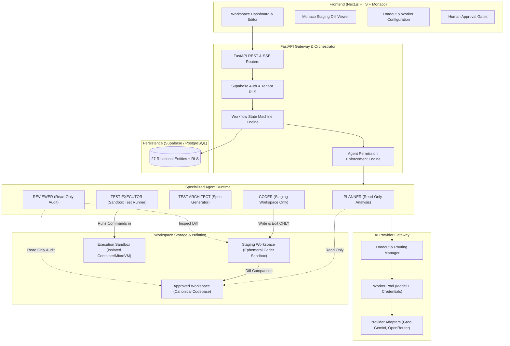
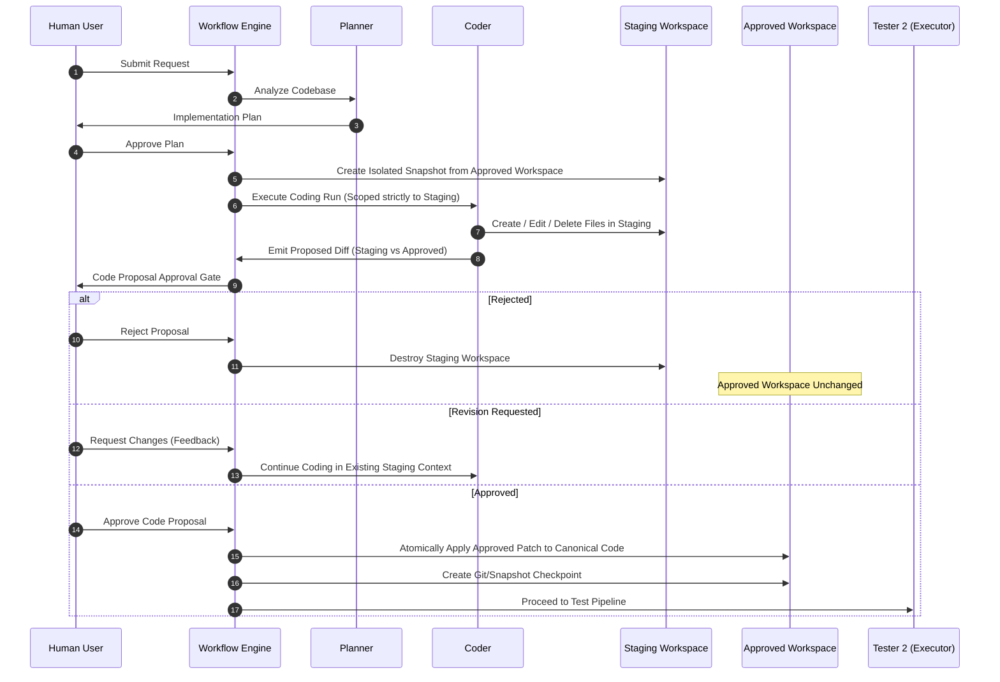

# System Architecture: Cloud-Based AI Software Engineering Workspace

## 1. Executive Summary

This document defines the architectural foundations for the persistent cloud-based AI software engineering workspace. The platform empowers developers to work alongside specialized autonomous agents in an isolated, secure, and auditable environment.

### Core Architectural Axioms
1. **Workspace State Decoupling**: The workspace and its persistence layers own all state (files, tasks, plans, diffs, test results, approvals). AI models are stateless, replaceable worker units.
2. **Approved vs. Staging Workspace Isolation**: Coder modifications never occur directly within the approved workspace. Changes are written strictly to an isolated Staging Workspace, producing a proposal diff. Only upon explicit human approval is the diff atomically applied to the Approved Workspace.
3. **Mandatory Baseline Verification**: The Test Executor executes a non-negotiable baseline verification suite (dependency install, type-checking, linting, production build, unit/integration tests, health verification) before executing custom tests generated by the Test Architect.
4. **Strict Least-Privilege Agent Roles**: Each agent role possesses an unalterable, cryptographically enforced tool capability boundary. Reviewer and Planner have zero file-modification permissions. Reviewer has zero command execution capabilities.
5. **Auditable Hot Swapping**: Changing models or falling back during a rate-limit retains task and conversation continuity without creating a new task, while recording complete worker provenance in the agent run audit trail.

---

## 2. High-Level Architecture



---

## 3. Approved vs. Staging Workspace Model

To eliminate the contradiction where a Coder can edit files before human approval:



### Specifications:
- **Approved Workspace**: Represents the canonical, verified, and accepted state of the repository. No agent may write directly to this workspace without an explicit `HUMAN_CODE_APPROVAL` event.
- **Staging Workspace**: An ephemeral, isolated copy or copy-on-write snapshot created for the task. The Coder agent's file modification tools are strictly locked to this root path.
- **Atomic Promotion**: Upon human approval, the unified diff generated between Staging and Approved is applied atomically. If patching fails, the transaction rolls back, preserving integrity.

---

## 4. Environment Modes

1. **Sandboxed Mode**:
   - Project environment is fully isolated inside containerized or microVM runtimes (e.g., gVisor / Docker).
   - Completely air-gapped from the user's host machine.
   - Strict resource quotas (CPU, Memory, Disk, PIDs, Network egress allowlists).
2. **Connected Mode**:
   - Supports external repository syncing (GitHub, GitLab) and external integrations.
   - Operations require explicit user-consented scopes and tokens.
   - Outbound network calls operate through audited proxy gateways.

---

## 5. Agent Specialization & Execution Principles

### 1. PLANNER
- **Role**: Read codebase, evaluate request, draft structured implementation plan.
- **Capabilities**: Read-only access to Approved Workspace, dependency manifests, and architecture documentation.
- **Output**: Implementation Plan with affected files, step-by-step rationale, and test recommendations.
- **Constraints**: ZERO file write or command execution capabilities.

### 2. CODER
- **Role**: Translate approved plan into concrete file edits.
- **Capabilities**: Read access to Approved Workspace and Plan; full write/edit/delete access to **Staging Workspace ONLY**.
- **Output**: Proposed Diff between Staging and Approved workspaces.
- **Constraints**: Cannot access or modify the Approved Workspace directly; cannot execute commands or launch external processes.

### 3. TEST ARCHITECT (Tester 1)
- **Role**: Define comprehensive test specifications based on user request, approved plan, and proposed diff.
- **Capabilities**: Read-only access to Approved Workspace, Staging Diff, and Plan.
- **Output**: Test Plan containing unit, regression, integration, edge-case, and security test case definitions.
- **Constraints**: Read-only. Cannot modify production source code or execute commands.

### 4. TEST EXECUTOR (Tester 2)
- **Role**: Execute verification in an isolated sandbox.
- **Capabilities**: Executes shell commands inside the Sandbox environment.
- **Execution Order**:
  1. **Mandatory Baseline Verification**:
     - Dependency / installation validation
     - Static type checking (e.g., `tsc`, `mypy`)
     - Code linting (e.g., `eslint`, `ruff`)
     - Production build verification
     - Existing unit tests
     - Existing integration tests
     - Basic application startup / health check
  2. **Test Architect Test Suite**: Runs new tests authored by Test Architect.
- **Failure Loop**: On any failure, produces a structured failure report and routes back to Coder.
- **Constraints**: Cannot modify approved production files.

### 5. REVIEWER
- **Role**: Independent, objective code and quality audit.
- **Capabilities**: Strictly read-only inspection of:
  - Approved Workspace files
  - Staging Proposed Diff
  - Approved Plan
  - Test Plan and Test Results
  - Build logs and sandbox execution history
  - Previous agent run transcripts
- **Output**: Final Review Report (Score, Findings, Security Considerations, Approval Recommendation).
- **Constraints**: Permanently read-only. Cannot write files, edit staging, run shell commands, install packages, switch loadouts, or approve reviews.

---

## 6. AI Provider, Worker, and Loadout Abstraction

The AI gateway separates orchestration from specific LLM providers (Groq, Gemini, OpenRouter):

```text
[Agent Role]
      │
      ▼
[Loadout Mapping] ──(selects)──► [Worker]
                                    │
                                    ├── Provider: Groq
                                    ├── Model: llama-3.3-70b-versatile
                                    └── Credentials: Encrypted Key
                                    │
                                    ▼
                         [Provider Adapter] ──► [External API]
```

### Worker Provenance & Hot Swapping
- **Stateless Models**: Task state, conversation history, and tool outputs live exclusively in PostgreSQL.
- **Hot Swapping During Rate Limits**:
  - If Worker A hits a `429 Too Many Requests` or network timeout, the Loadout Engine transparently invokes fallback Worker B.
  - No new task is created. The conversation and agent memory remain completely intact.
  - The `agent_runs` table logs both the initial worker and the replacement worker (`fallback_used = true`, `fallback_reason`, `worker_id`).

### Loadout Terminology
- **LOADOUT SWITCH**: Changes the configured worker assignment for the workspace or task.
- **AGENT HOT SWAP**: Changes only the worker used by a particular agent run (e.g., automatic failover).
- **TEMPORARY OVERRIDE**: Changes the worker only for the current run or task without mutating the saved loadout.

---

## 7. Persistence and Database Entities

The persistence layer is implemented in Supabase (PostgreSQL with Row Level Security). It contains **exactly 27 relational entities**:

1. `users`
2. `providers`
3. `credentials`
4. `workers`
5. `loadouts`
6. `workspaces`
7. `staging_workspaces`
8. `workspace_settings`
9. `files`
10. `file_metadata`
11. `codebase_analyses`
12. `conversations`
13. `messages`
14. `tasks`
15. `agent_runs`
16. `agent_states`
17. `plans`
18. `approvals`
19. `code_proposals`
20. `diffs`
21. `test_plans`
22. `test_cases`
23. `test_executions`
24. `build_results`
25. `reviewer_reports`
26. `execution_logs`
27. `git_snapshots`

---

## 8. Security Architecture

1. **Credential Safety**: API keys are encrypted at rest using AES-256-GCM. Decryption keys are stored in secure environment secrets managers. Plaintext keys are never returned across client APIs.
2. **Sandbox Containment**: Sandbox execution runs in dedicated, disposable containers/microVMs with restricted system calls (seccomp/gVisor), dropped Linux capabilities (`CAP_DROP ALL`), non-root user execution, and strict memory/CPU cgroups.
3. **Deterministic Permission Enforcement**: Tools are injected into agent execution contexts through a central Permission Gatekeeper. Any tool call outside the role's permission matrix raises an unauthorized security violation and terminates the agent run.
