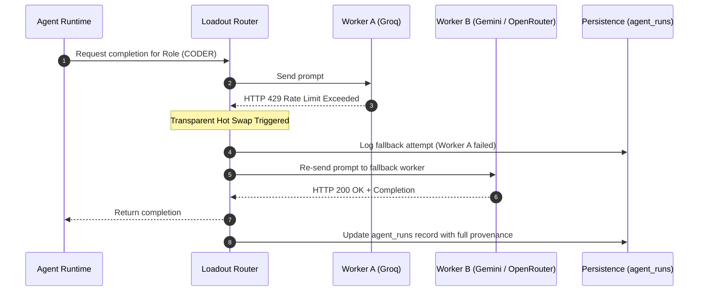

# Provider, Worker, and Loadout Abstraction Layer

## 1. Architectural Philosophy

The AI subsystem must never be tightly coupled to any single LLM vendor or proprietary API format. 

Models are treated as **stateless execution workers**. All state—including conversation histories, agent context, plans, diffs, test results, and tasks—is owned exclusively by the workspace and stored in PostgreSQL.

```text
[Agent Role] ──► [Worker] ──► [Provider Adapter] ──► [Vendor Model API]
```

---

## 2. Terminology & Key Distinctions

To ensure unambiguous operational semantics, three distinct operations govern worker assignment:

### 1. LOADOUT SWITCH
- **Scope**: Workspace or Persistent Default.
- **Definition**: Changes the configured mapping of agent roles to designated workers (e.g., migrating a workspace from the "Free Stack" loadout to the "Pro Production Stack").
- **Effect**: Persisted in `workspace_settings.active_loadout_id`. Applies to all subsequent tasks in that workspace. Historical task records and previous run configurations remain immutable.

### 2. AGENT HOT SWAP
- **Scope**: Discrete Agent Execution Run.
- **Definition**: Dynamically swaps the worker executing a specific agent role during a live run (e.g., when Worker A hits a rate limit `429`, failover immediately invokes Worker B).
- **Effect**: Does NOT create a new task. Does NOT mutate the saved loadout. Preserves the full conversation thread and agent scratchpad. The audit trail records the substitution.

### 3. TEMPORARY OVERRIDE
- **Scope**: Single Task or Run.
- **Definition**: The user explicitly designates a specific worker or model configuration for one task without altering the workspace's default loadout.
- **Effect**: Stored in `tasks.worker_overrides`. Once the task completes, the workspace reverts to its default loadout.

---

## 3. Worker Provenance & Failover (Hot Swap) Model

When a worker encounters a transient error, rate-limit (`429 Too Many Requests`), context window exhaustion, or service outage:



### Invariant:
A worker failover **must never create a new task** or destroy the active conversation and state. The system records the complete provenance in `agent_runs`:
- `agent_run_id`: UUID
- `task_id`: UUID of current task
- `agent_role`: e.g. `coder`
- `loadout_id`: Configured loadout
- `worker_id`: Final worker that produced the output
- `provider_id`: Provider of final worker
- `model_name`: Exact model string
- `started_at`: Timestamp of run initiation
- `completed_at`: Timestamp of run completion
- `fallback_used`: Boolean (`true` if failover occurred)
- `fallback_reason`: Detailed reason (e.g. `rate_limit_429: groq/llama-3.3-70b`)
- `execution_status`: Status enum (`success`, `failed`, `timeout`)

---

## 4. Provider Gateway Layer

### `BaseProviderAdapter` Interface
Every vendor adapter implements a standardized asynchronous Python contract:

```python
class BaseProviderAdapter(ABC):
    @abstractmethod
    async def generate_completion(self, request: CompletionRequest) -> CompletionResponse:
        """Standard unary completion with tool-calling support."""
        pass

    @abstractmethod
    async def stream_completion(self, request: CompletionRequest) -> AsyncIterator[CompletionChunk]:
        """Stream token deltas and tool-call deltas."""
        pass

    @abstractmethod
    async def validate_credentials(self, credentials: EncryptedCredentials) -> bool:
        """Verify API key validity against the upstream provider."""
        pass
```

### Supported Initial Providers
1. **Groq Adapter**: Ultra-fast inference with tool use support (e.g., `llama-3.3-70b-versatile`).
2. **Gemini Adapter**: Deep reasoning and massive context window (e.g., `gemini-2.5-flash`, `gemini-2.5-pro`).
3. **OpenRouter Adapter**: Unified gateway for fallback routing across various open/proprietary models.

---

## 5. Loadout Schema & Example Configurations

A loadout specifies the worker binding for each of the 5 agent roles, along with optional fallback cascades:

```json
{
  "loadout_id": "loadout-free-tier",
  "name": "Free Tier Stack",
  "mappings": {
    "planner": {
      "primary_worker_id": "worker-groq-llama-70b",
      "fallback_worker_ids": ["worker-openrouter-mistral"]
    },
    "coder": {
      "primary_worker_id": "worker-groq-llama-70b",
      "fallback_worker_ids": ["worker-gemini-flash"]
    },
    "test_architect": {
      "primary_worker_id": "worker-groq-llama-70b",
      "fallback_worker_ids": ["worker-gemini-flash"]
    },
    "test_executor": {
      "primary_worker_id": "worker-groq-llama-70b",
      "fallback_worker_ids": ["worker-gemini-flash"]
    },
    "reviewer": {
      "primary_worker_id": "worker-groq-llama-70b",
      "fallback_worker_ids": ["worker-gemini-flash"]
    }
  }
}
```
