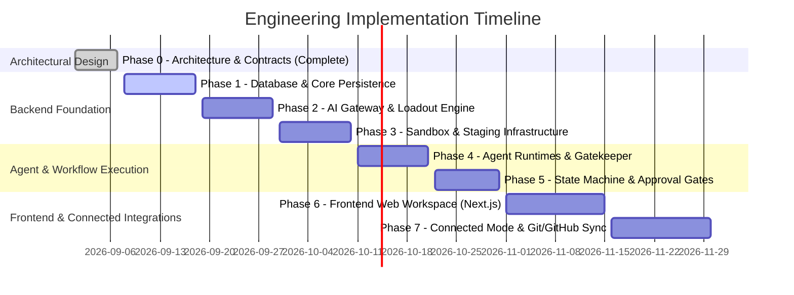

# Implementation Roadmap: Cloud AI Software Engineering Workspace

## Phase Summary Overview

---

## Phase Details

### Phase 0: Architectural Foundations & Engineering Contracts (CURRENT - FINALIZED)
- **Objective**: Establish blueprints, typed contracts, permission boundaries, and database schemas.
- **Deliverables**:
  - `docs/ARCHITECTURE.md`
  - `docs/AGENT_PERMISSION_MATRIX.md`
  - `docs/WORKFLOW_STATE_MACHINE.md`
  - `docs/PROVIDER_WORKER_LOADOUT.md`
  - `docs/ENGINEERING_CONVENTIONS.md`
  - `docs/ROADMAP.md`
  - `schema/supabase_schema.sql` (27 relational entities)
  - Backend Pydantic v2 domain schemas and protocols
  - Frontend TypeScript contract definitions

---

### Phase 1: Core Persistence, Auth & Secret Encryption
- **Objective**: Deploy Supabase database schema and core FastAPI backend services.
- **Deliverables**:
  - Supabase database migrations for 27 entities.
  - AES-256-GCM encryption service for provider credentials.
  - Supabase JWT authentication middleware with tenant-level Row Level Security (RLS).
  - CRUD repository layers for users, workspaces, loadouts, and tasks.

---

### Phase 2: AI Gateway & Loadout Engine
- **Objective**: Implement vendor-agnostic LLM layer with hot-swapping and audit logging.
- **Deliverables**:
  - `BaseProviderAdapter` implementation.
  - Groq provider adapter (`llama-3.3-70b-versatile`).
  - Gemini provider adapter (`gemini-2.5-flash`, `gemini-2.5-pro`).
  - OpenRouter adapter for broad model access.
  - Loadout routing engine with automated failover (hot-swapping on `429` / timeouts).
  - Worker provenance recording in `agent_runs`.

---

### Phase 3: Sandbox Driver & Staging Workspace Engine
- **Objective**: Implement isolated code execution and atomic staging workspaces.
- **Deliverables**:
  - `BaseSandboxDriver` container interface (Docker/gVisor microVMs).
  - Staging workspace manager: copy-on-write snapshotting from Approved Workspace.
  - Unified diff generator comparing staging files against canonical files.
  - Atomic patch promotion engine with transaction rollback on conflict.
  - Snapshot checkpointing (`git_snapshots`).

---

### Phase 4: Agent Runtimes & Permission Gatekeeper
- **Objective**: Implement 5 specialized agent personas with strict role enforcement.
- **Deliverables**:
  - `AgentPermissionGatekeeper` verifying every tool call against the permission matrix.
  - **PLANNER**: Codebase analysis & implementation plan authoring.
  - **CODER**: Staging-scoped file editing and diff generation.
  - **TEST ARCHITECT**: Functional, regression, edge-case, and security test case generation.
  - **TEST EXECUTOR**: Mandatory 6-point baseline execution + test suite runner in sandbox.
  - **REVIEWER**: Strictly read-only multi-source audit and final report generation.

---

### Phase 5: Workflow State Machine & Human Approval Gates
- **Objective**: Build the deterministic workflow orchestrator.
- **Deliverables**:
  - State machine engine tracking transitions across `IDLE`, `PLANNING`, `PLAN_REVIEW`, `STAGING_SETUP`, `CODING`, `CODE_REVIEW`, `PROMOTING`, `TEST_PLANNING`, `TEST_EXECUTING`, `REVIEWING`.
  - Human Plan Approval gate with revision loop.
  - Human Code Approval gate with atomic promotion or staging discard.
  - Automated failure loop from Test Executor back to Coder with structured failure report.

---

### Phase 6: Frontend Workspace Experience (Next.js & Monaco)
- **Objective**: Deliver a responsive, reactive developer interface.
- **Deliverables**:
  - Workspace dashboard with project import.
  - Split-pane Monaco editor featuring Staging vs Approved Diff viewer.
  - Interactive approval modals for Plan Review and Code Review.
  - Real-time SSE streaming for agent reasoning, command stdout/stderr, and test results.
  - Loadout configurator (Free Stack, Pro Stack, custom model assignment).

---

### Phase 7: Connected Mode & GitHub Integrations
- **Objective**: Add external repository sync and collaborative workflow features.
- **Deliverables**:
  - OAuth2 GitHub app integration.
  - Branch cloning, commit signing, and automated Pull Request creation.
  - Granular connected-mode permission prompts for outbound network access.
