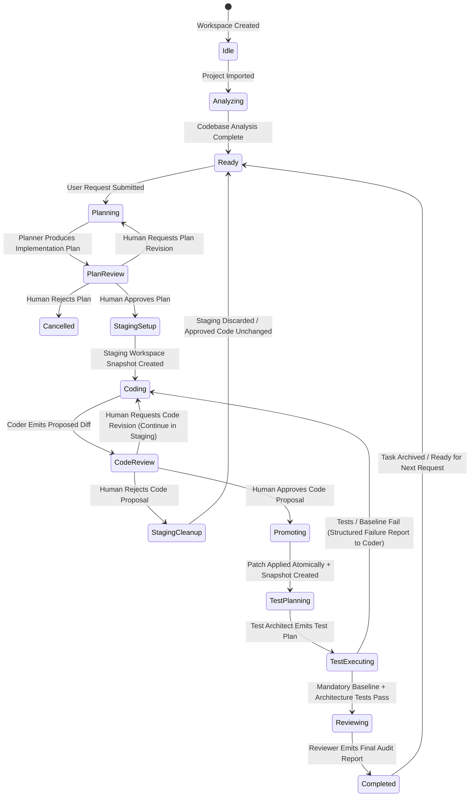
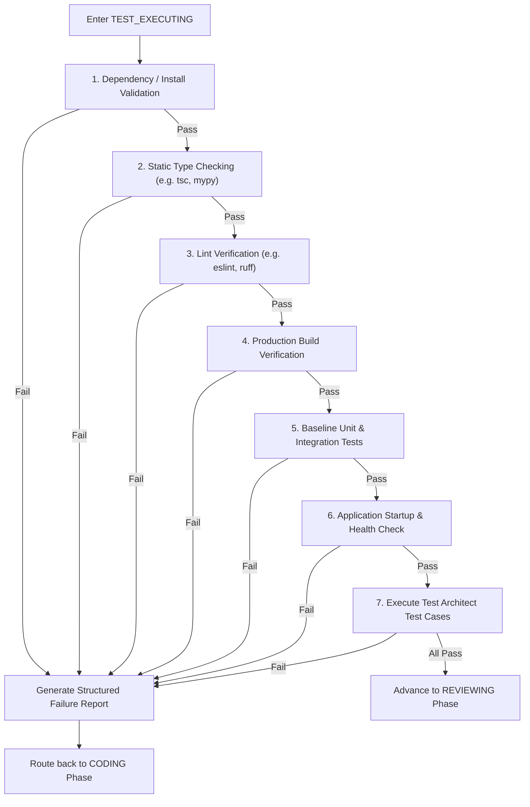

# Workflow State Machine & Approval Gates

## 1. Overview

The workspace execution lifecycle is governed by an explicit, deterministic state machine. Workflow progression is blocked at critical safety gates until human input or automated verification criteria are satisfied.

No agent can unilaterally advance workflow state across human gates.

---

## 2. State Machine Diagram

---

## 3. Detailed State Definitions

| State Name | Active Participant | Preconditions | Exit Conditions / Next State |
| :--- | :--- | :--- | :--- |
| `IDLE` | System / User | Workspace created or previous task finalized | User imports repository or starts task |
| `ANALYZING` | Analysis Engine | Repository imported | Codebase analysis persisted → `READY` |
| `READY` | User | Workspace healthy, analysis complete | User submits request → `PLANNING` |
| `PLANNING` | PLANNER Agent | User request submitted | Implementation plan generated → `PLAN_REVIEW` |
| `PLAN_REVIEW` | Human User | Plan submitted by Planner | - **Approved** → `STAGING_SETUP` - **Revision** → `PLANNING` - **Rejected** → `CANCELLED` |
| `STAGING_SETUP` | Workflow Engine | Human approved plan | Isolated staging snapshot initialized → `CODING` |
| `CODING` | CODER Agent | Staging workspace ready or revision/failure loop | Proposed diff emitted from staging → `CODE_REVIEW` |
| `CODE_REVIEW` | Human User | Coder generated proposed diff | - **Approved** → `PROMOTING` - **Revision** → `CODING` (retains staging) - **Rejected** → `STAGING_CLEANUP` |
| `STAGING_CLEANUP`| Workflow Engine | Code proposal rejected | Staging workspace deleted → `READY` |
| `PROMOTING` | Workflow Engine | Human approved code | Diff atomically applied to Approved Workspace + snapshot saved → `TEST_PLANNING` |
| `TEST_PLANNING` | TEST ARCHITECT (Tester 1) | Code applied to approved workspace | Test plan emitted (functional, regression, security) → `TEST_EXECUTING` |
| `TEST_EXECUTING`| TEST EXECUTOR (Tester 2) | Test plan ready | - **Pass** (Baseline + Test Cases) → `REVIEWING` - **Fail** → `CODING` (with Failure Report) |
| `REVIEWING` | REVIEWER Agent | All tests passed | Final review report submitted → `COMPLETED` |
| `COMPLETED` | System / User | Review report submitted | Task archived → `READY` |
| `CANCELLED` | System / User | User rejected plan | Task closed, state reset → `READY` |

---

## 4. The Two Human Approval Gates

### Gate 1: Human Plan Approval (`PLAN_REVIEW`)
- **Inputs**: Original User Request + Planner Implementation Plan (affected files, rationale, architectural steps).
- **Decisions**:
  - **Approve**: Engine provisions an isolated `staging_workspace` cloned from current canonical `approved_workspace` and invokes `CODER`.
  - **Request Revision**: User provides feedback. Workflow returns to `PLANNING` with feedback injected into agent context.
  - **Reject**: Workflow transitions to `CANCELLED`. No workspace changes occur.

### Gate 2: Human Code Approval (`CODE_REVIEW`)
- **Inputs**: Proposed Unified Diff (Staging Workspace vs Approved Workspace) + Coder Summary.
- **Decisions**:
  - **Approve**: Engine acquires write-lock, atomically applies the diff to the canonical `approved_workspace`, registers a new `git_snapshots` entry, and moves to `TEST_PLANNING`.
  - **Request Revision**: Staging workspace is retained. Coder is invoked again in the same staging workspace with user feedback.
  - **Reject**: Engine completely purges the `staging_workspace`. Canonical `approved_workspace` remains 100% untouched.

---

## 5. Mandatory Baseline Verification & Test Execution Policy

The `TEST_EXECUTING` phase is strictly ordered and non-negotiable. 

### Invariant:
Test Architect cannot modify, disable, or supersede any portion of the 6 mandatory baseline checks. If baseline checks fail or custom test cases fail, the Test Executor emits a typed `FailureReport` and returns execution to the `CODING` state.
